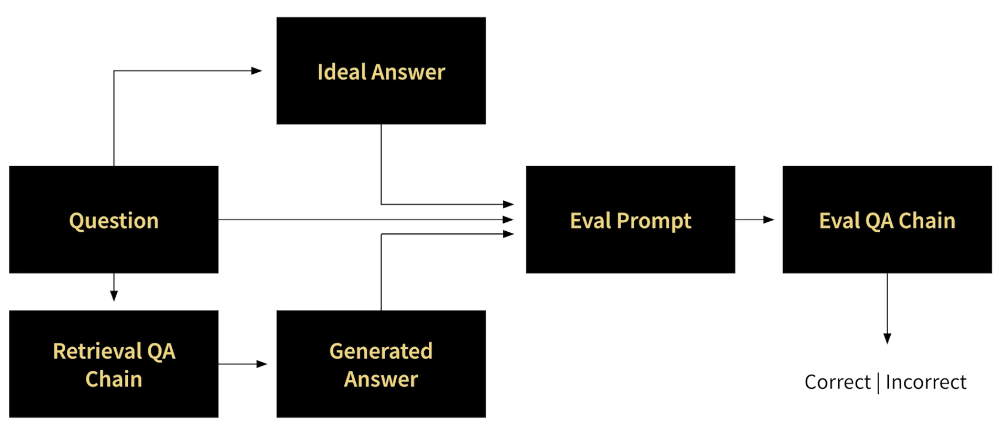

# Evaluating LLM Apps
Before starting to improve an LLM app, it's essential to decide how to evaluate the effectiveness of the changes made. This is challenging due to unstructured and stochastic nature of the outputs.

* `Vibes check`: 
  * During LLM training manually prompt and assess the outputs. This is a quick and subjective way of assessing model improvements. But not ideal to objectively compare tens or hundreds of experiments. 

* `Model-based evaluation`: 
  * To automate the evaluation process, we can use another LLM. 
  * Here, we gather a dataset of questions and corresponding ideal answers. 
    * Ideally, the questions come from a production service and ideal answers are manually annotated by experts.
    * We can also create a synthetic dataset (as done in [1_generation.ipynb](/notebooks/1_generation.ipynb)).
  * Fit this dataset to the LLM (to be evaluated) and generate an answers.
  * The evaluation LLM then judges if the generated answers are correct, which can then be summarised as an overall accuracy metric.

    

* `Unit testing`:
  * For a fixed query, we extract a set of specific items to validate (test) the query. 
  * Each query example might have a different set of tests items. Aim is to pass as many as possible.
  * This approach requires more effort but can yield more robust results.

* `A/B testing in production`:
  * Collecting user feedback and tracking performance in production. 
    * For example, enable thumbs up and down reactions.
    * Can then monitor the percentage of positive and negative reactions over time.
  * Critical to be able to track performance to a specific version of the LLM (using W&B artifacts).

# Identifying areas of improvement

Start by looking at the App architecture, and considering which elements might be under-performing. 

Error analysis (finding at which point models break) can be conducted with tools like `W&B Tracer`. Taking the image above as a reference:
* We don't have much control on the quality of `users questions`. But can improve the quality of the UI and guiding users to as specific questions.
* Frequent root of errors is the document search. Embedding model might not `retrieve` relevant docs. In such case we might: 1) add a keyword search, 2) train a custom embedding model for our dataset, 3) explore different similarity search methods.
* Bad responses might also be due to `insufficient docs`. In this case improving/updating docs would be useful.
* The `prompt template` can also have a significant impact on LLM responses. There are prompt engineering techniques to steer the model to generate desired outputs.
* Can experiment with different `LLM` models, or train/fine-tune a custom model.
* Can adjust sampling parameters (eg. `temperature` or `top P`)

# Strategies and ideas to enhance app

## Document search

Considered a bottleneck in many applications. 

`Problem`: Certain words (eg. proper names or new terms) might not be well represented by embedding models.
* `Solution`: Combine embedding search with keyword-based search methods.

`Problem`: Questions and answers are far away in the embedding space. Hence, difficult for embedding models to find right match.
* `Solution`: Use hypothetical document embeddings, where an LLM generates a hypothetical answer to a user question, and then the answer is embedded and used to search for relevant docs.

`Problem`: With a limited number of docs in a prompt, and large number of similar docs, the retrieved docs may lack diversity.
* `Solution`: Use maximal marginal relevance (MMR) - helps balance relevance and diversity. This increases chance that we find correct answer in the prompt.

`Problem`: Domain specific questions and docs, may not be represented well in generic models.
* `Solution`: Training a custom embedding model on your own data (designed on your domain) can improve performance

## Chains

We can experiment with different chain types available in `LangChain`. Different chain types are:

`Stuff`:
* Baseline solution.
* Stuff all related data into the prompt as context to pass to the LLM (see [1_generation.ipynb](../notebooks/1_generation.ipynb)).

`MapReduce`:
* Opportunity - Extract relevant data 
* Run an initial prompt on each chunk of data (to extract relevant info) and then `combine` the outputs in a separate prompt (to feed to LLM).

`Refine`:
* Opportunity - Refine answer with new data
* Run an initial prompt on the first chunk of data, `refine` the output based on the new document for subsequent docs.

`Map-Rerank`:
* Run an initial prompt on each chunk of data, `rank` the responses based on the certainty score and rerun the highest scored data.

Higher fidelity chain types (MapReduce, Refine, Map-Rerank) can lead to better results, but can aldo increase cost and latency.

## LLMs

There are a few providers available: OpenAI, Cohere, Anthropic, HuggingFace, Meta, Mosaic, EleutherAI.

## Prompt engineering

[Prompt engineering](https://www.promptingguide.ai/) is an important aspect of of building an LLM app (active research area). Different prompting methods include: Zero-shot, Few-shot, Chain-of-thought, Self-consistency, Generate-knowledge, Active-prompt, Directionsl Stimulus, ReAct, Multimodal CoT, Graph, Tree-of-Thoughts.